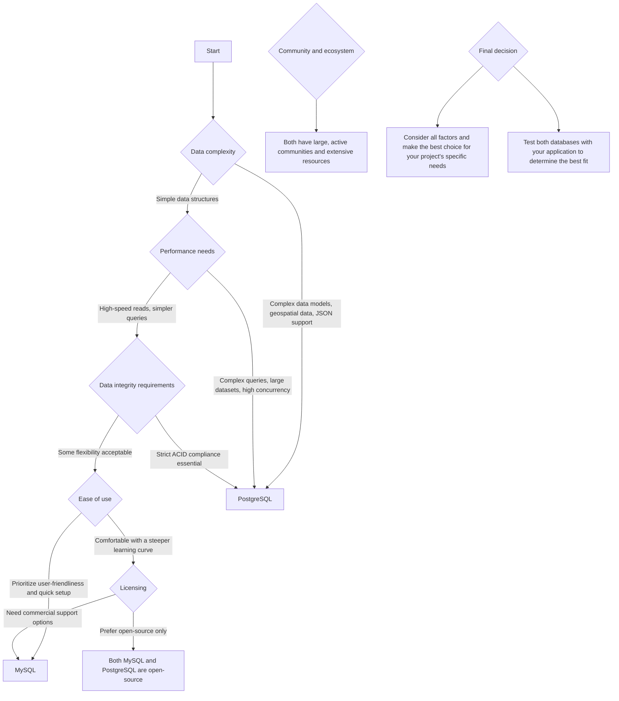

```mermaid
graph TD
    A[Start]
    B{Data complexity}
    C{Performance needs}
    D{Data integrity requirements}
    E{Ease of use}
    F{Licensing}
    G{Community and ecosystem}
    H{Final decision}
    I[PostgreSQL]
    J[MySQL]
    K[Both MySQL and PostgreSQL are open-source]
    L[Both have large, active communities and extensive resources]
    M[Consider all factors and make the best choice for your project's specific needs]
    N[Test both databases with your application to determine the best fit]
    
    A --> B
    B -->|Simple data structures| C
    B -->|Complex data models, geospatial data, JSON support| I
    C -->|High-speed reads, simpler queries| D
    C -->|Complex queries, large datasets, high concurrency| I
    D -->|Strict ACID compliance essential| I
    D -->|Some flexibility acceptable| E
    E -->|Prioritize user-friendliness and quick setup| J
    E -->|Comfortable with a steeper learning curve| F
    F -->|Prefer open-source only| K
    F -->|Need commercial support options| J
    G --> L
    H --> M
    H --> N
```
